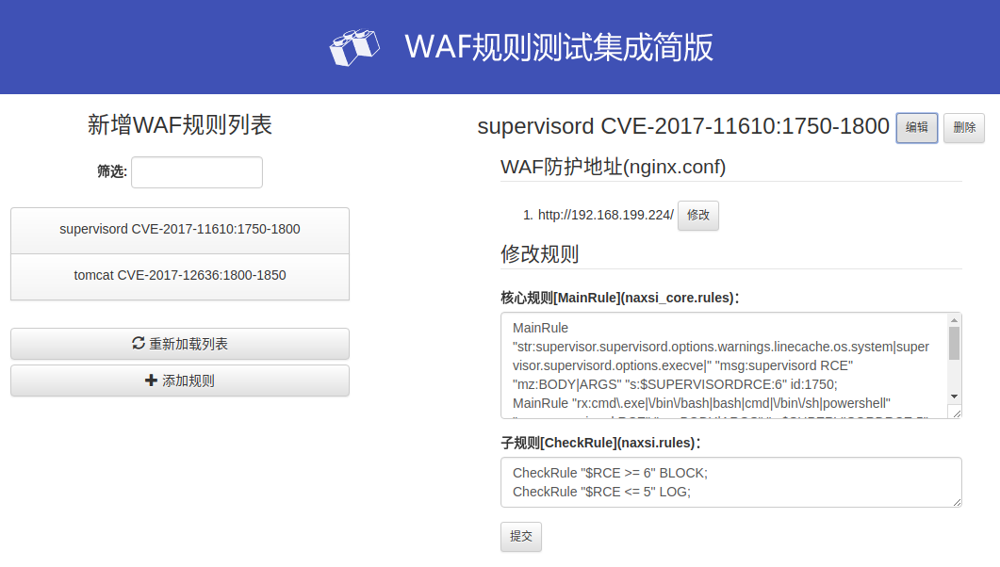
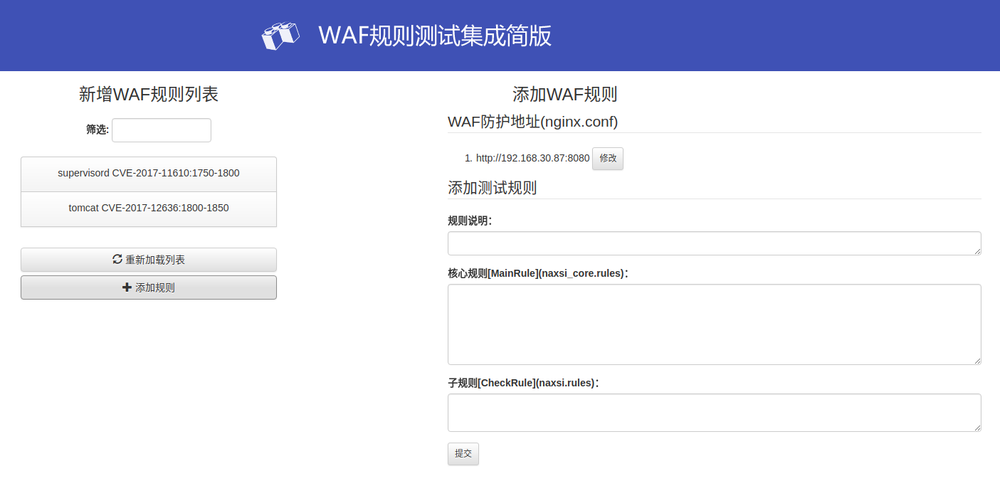

# docker for waf test-ui

#### usage:
1. git clone https://github.com/XoneStar/waf-test-ui.git
2. cd waf-test-ui
3. docker build -t waf-test-ui .
4. docker run --name waf-test-ui -d -p 80:80 -p 5000:5000 waf-test-ui

#### or

1. docker pull creatorx/waf-test-ui
2. docker run --name waf-test-ui -d -p 80:80 -p 5000:5000 creatorx/waf-test-ui

#### waf test ui
web URL: http://ip:5000

nginx port : 80
 

